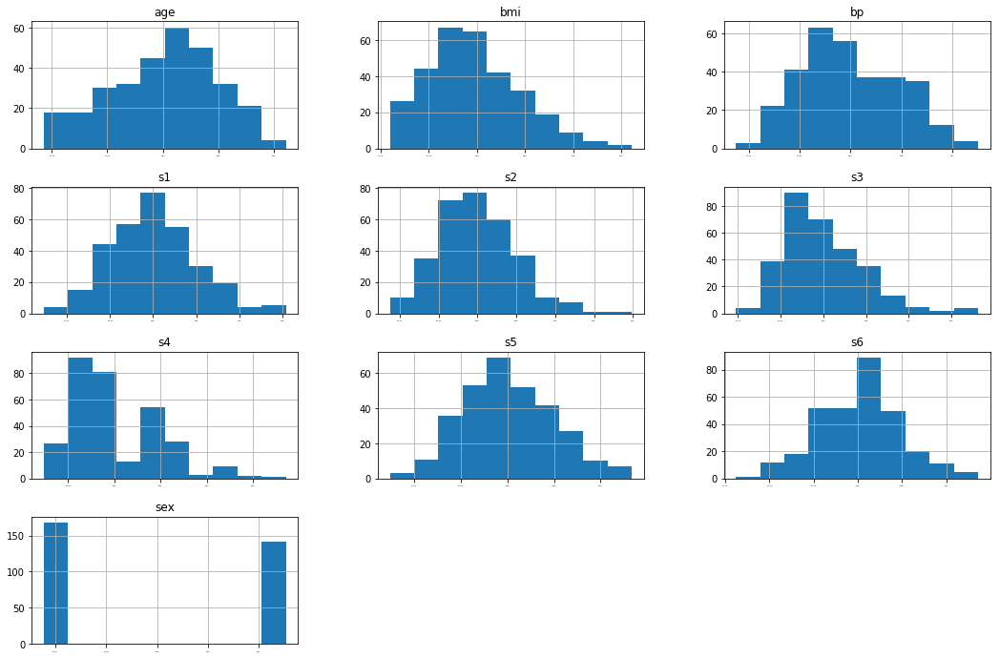
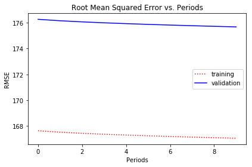
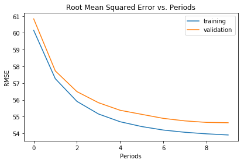
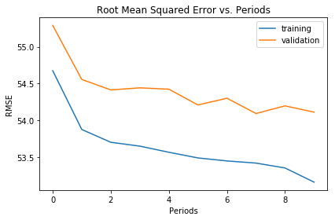
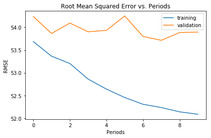

## 基于sklearn糖尿病数据集（diabetes）的线性回归模型和深度神经网络模型的对比

### diabetes 是一个关于糖尿病的数据集， 该数据集包括442个病人的生理数据及一年以后的病情发展情况。   
#### 数据集中的特征值总共10项, 如下:  
#### ['age', 'sex', 'bmi', 'bp', 's1', 's2', 's3', 's4', 's5', 's6']
年龄  
性别  
体质指数  
血压  
s1,s2,s3,s4,s4,s6  (六种血清的化验数据)  
target 为糖尿病进展的数据
#### 但请注意，以上的数据是经过特殊处理，10个特征的数据中的每个都做了均值中心化处理，然后又用标准差乘以个体数量调整了数值范围。验证就会发现任何一列的所有数值平方和为1. 


```python
import math

from IPython import display
from matplotlib import cm
from matplotlib import gridspec
import matplotlib.pyplot as plt
import numpy as np  
import pandas as pd
from sklearn import datasets
from sklearn import metrics
import tensorflow as tf
from tensorflow.python.data import Dataset
```

    /usr/local/lib/python3.5/dist-packages/h5py/__init__.py:36: FutureWarning: Conversion of the second argument of issubdtype from `float` to `np.floating` is deprecated. In future, it will be treated as `np.float64 == np.dtype(float).type`.
      from ._conv import register_converters as _register_converters


### 添加数据集


```python
diabetes = datasets.load_diabetes()  
```


```python
#查看数据量
len(diabetes.data[:,0])
```


    442


```python
diabetes.data[0,:]
```


    array([ 0.03807591,  0.05068012,  0.06169621,  0.02187235, -0.0442235 ,
           -0.03482076, -0.04340085, -0.00259226,  0.01990842, -0.01764613])


```python
#求证： 每一列的数值的平方和为1  
np.sum( diabetes.data[:,0]**2)  #求年龄列  
```


    1.0000000000000746


```python
np.sum(diabetes.data[:,3])
```


    5.700995231450179e-14


```python
df_diabetes = pd.DataFrame(diabetes.data,columns = diabetes.feature_names)
df_diabetes['target'] = pd.Series(diabetes.target)
```


```python
df_diabetes.head()#查看前五行数据
```


<div>
<style scoped>
    .dataframe tbody tr th:only-of-type {
        vertical-align: middle;
    }

    .dataframe tbody tr th {
        vertical-align: top;
    }

    .dataframe thead th {
        text-align: right;
    }
</style>
<table border="1" class="dataframe">
  <thead>
    <tr style="text-align: right;">
      <th></th>
      <th>age</th>
      <th>sex</th>
      <th>bmi</th>
      <th>bp</th>
      <th>s1</th>
      <th>s2</th>
      <th>s3</th>
      <th>s4</th>
      <th>s5</th>
      <th>s6</th>
      <th>target</th>
    </tr>
  </thead>
  <tbody>
    <tr>
      <th>0</th>
      <td>0.038076</td>
      <td>0.050680</td>
      <td>0.061696</td>
      <td>0.021872</td>
      <td>-0.044223</td>
      <td>-0.034821</td>
      <td>-0.043401</td>
      <td>-0.002592</td>
      <td>0.019908</td>
      <td>-0.017646</td>
      <td>151.0</td>
    </tr>
    <tr>
      <th>1</th>
      <td>-0.001882</td>
      <td>-0.044642</td>
      <td>-0.051474</td>
      <td>-0.026328</td>
      <td>-0.008449</td>
      <td>-0.019163</td>
      <td>0.074412</td>
      <td>-0.039493</td>
      <td>-0.068330</td>
      <td>-0.092204</td>
      <td>75.0</td>
    </tr>
    <tr>
      <th>2</th>
      <td>0.085299</td>
      <td>0.050680</td>
      <td>0.044451</td>
      <td>-0.005671</td>
      <td>-0.045599</td>
      <td>-0.034194</td>
      <td>-0.032356</td>
      <td>-0.002592</td>
      <td>0.002864</td>
      <td>-0.025930</td>
      <td>141.0</td>
    </tr>
    <tr>
      <th>3</th>
      <td>-0.089063</td>
      <td>-0.044642</td>
      <td>-0.011595</td>
      <td>-0.036656</td>
      <td>0.012191</td>
      <td>0.024991</td>
      <td>-0.036038</td>
      <td>0.034309</td>
      <td>0.022692</td>
      <td>-0.009362</td>
      <td>206.0</td>
    </tr>
    <tr>
      <th>4</th>
      <td>0.005383</td>
      <td>-0.044642</td>
      <td>-0.036385</td>
      <td>0.021872</td>
      <td>0.003935</td>
      <td>0.015596</td>
      <td>0.008142</td>
      <td>-0.002592</td>
      <td>-0.031991</td>
      <td>-0.046641</td>
      <td>135.0</td>
    </tr>
  </tbody>
</table>
</div>


```python
df_diabetes.describe() #共有442条数据 需要预测的target糖尿病进展的数据在25-346之间
```


<div>
<style scoped>
    .dataframe tbody tr th:only-of-type {
        vertical-align: middle;
    }

    .dataframe tbody tr th {
        vertical-align: top;
    }

    .dataframe thead th {
        text-align: right;
    }
</style>
<table border="1" class="dataframe">
  <thead>
    <tr style="text-align: right;">
      <th></th>
      <th>age</th>
      <th>sex</th>
      <th>bmi</th>
      <th>bp</th>
      <th>s1</th>
      <th>s2</th>
      <th>s3</th>
      <th>s4</th>
      <th>s5</th>
      <th>s6</th>
      <th>target</th>
    </tr>
  </thead>
  <tbody>
    <tr>
      <th>count</th>
      <td>4.420000e+02</td>
      <td>4.420000e+02</td>
      <td>4.420000e+02</td>
      <td>4.420000e+02</td>
      <td>4.420000e+02</td>
      <td>4.420000e+02</td>
      <td>4.420000e+02</td>
      <td>4.420000e+02</td>
      <td>4.420000e+02</td>
      <td>4.420000e+02</td>
      <td>442.000000</td>
    </tr>
    <tr>
      <th>mean</th>
      <td>-3.639623e-16</td>
      <td>1.309912e-16</td>
      <td>-8.013951e-16</td>
      <td>1.289818e-16</td>
      <td>-9.042540e-17</td>
      <td>1.301121e-16</td>
      <td>-4.563971e-16</td>
      <td>3.863174e-16</td>
      <td>-3.848103e-16</td>
      <td>-3.398488e-16</td>
      <td>152.133484</td>
    </tr>
    <tr>
      <th>std</th>
      <td>4.761905e-02</td>
      <td>4.761905e-02</td>
      <td>4.761905e-02</td>
      <td>4.761905e-02</td>
      <td>4.761905e-02</td>
      <td>4.761905e-02</td>
      <td>4.761905e-02</td>
      <td>4.761905e-02</td>
      <td>4.761905e-02</td>
      <td>4.761905e-02</td>
      <td>77.093005</td>
    </tr>
    <tr>
      <th>min</th>
      <td>-1.072256e-01</td>
      <td>-4.464164e-02</td>
      <td>-9.027530e-02</td>
      <td>-1.123996e-01</td>
      <td>-1.267807e-01</td>
      <td>-1.156131e-01</td>
      <td>-1.023071e-01</td>
      <td>-7.639450e-02</td>
      <td>-1.260974e-01</td>
      <td>-1.377672e-01</td>
      <td>25.000000</td>
    </tr>
    <tr>
      <th>25%</th>
      <td>-3.729927e-02</td>
      <td>-4.464164e-02</td>
      <td>-3.422907e-02</td>
      <td>-3.665645e-02</td>
      <td>-3.424784e-02</td>
      <td>-3.035840e-02</td>
      <td>-3.511716e-02</td>
      <td>-3.949338e-02</td>
      <td>-3.324879e-02</td>
      <td>-3.317903e-02</td>
      <td>87.000000</td>
    </tr>
    <tr>
      <th>50%</th>
      <td>5.383060e-03</td>
      <td>-4.464164e-02</td>
      <td>-7.283766e-03</td>
      <td>-5.670611e-03</td>
      <td>-4.320866e-03</td>
      <td>-3.819065e-03</td>
      <td>-6.584468e-03</td>
      <td>-2.592262e-03</td>
      <td>-1.947634e-03</td>
      <td>-1.077698e-03</td>
      <td>140.500000</td>
    </tr>
    <tr>
      <th>75%</th>
      <td>3.807591e-02</td>
      <td>5.068012e-02</td>
      <td>3.124802e-02</td>
      <td>3.564384e-02</td>
      <td>2.835801e-02</td>
      <td>2.984439e-02</td>
      <td>2.931150e-02</td>
      <td>3.430886e-02</td>
      <td>3.243323e-02</td>
      <td>2.791705e-02</td>
      <td>211.500000</td>
    </tr>
    <tr>
      <th>max</th>
      <td>1.107267e-01</td>
      <td>5.068012e-02</td>
      <td>1.705552e-01</td>
      <td>1.320442e-01</td>
      <td>1.539137e-01</td>
      <td>1.987880e-01</td>
      <td>1.811791e-01</td>
      <td>1.852344e-01</td>
      <td>1.335990e-01</td>
      <td>1.356118e-01</td>
      <td>346.000000</td>
    </tr>
  </tbody>
</table>
</div>


```python
diabetes_dataframe = df_diabetes
#打乱数据的原有次序，随机重排
diabetes_dataframe = diabetes_dataframe.reindex(np.random.permutation(diabetes_dataframe.index))
```


```python
def preprocess_features(diabetes_dataframe):
  selected_features = diabetes_dataframe[["age", "sex", "bmi", "bp", "s1", "s2", "s3", "s4", "s5", "s6" ]]
  processed_features = selected_features.copy()
  return processed_features

def preprocess_targets(diabetes_dataframe):
  output_targets = pd.DataFrame()
  output_targets["target"] = diabetes_dataframe["target"]
  return output_targets
```

生成数据样本，包括训练样本和测试样本


```python
training_examples = preprocess_features(diabetes_dataframe.head(310))
training_targets = preprocess_targets(diabetes_dataframe.head(310))

validation_examples = preprocess_features(diabetes_dataframe.tail(132))
validation_targets = preprocess_targets(diabetes_dataframe.tail(132))
```


```python
_ = training_examples.hist(bins=10, figsize=(18, 12), xlabelsize=2)
```





相关矩阵展现了两两比较的相关性，既包括每个特征与目标特征之间的比较，也包括每个特征与其他特征之间的比较。

在这里，相关性被定义为皮尔逊相关系数。相关性值具有以下含义：

-1.0：完全负相关
0.0：不相关
1.0：完全正相关


```python
correlation_dataframe = training_examples.copy()
correlation_dataframe["target"] = training_targets["target"]

correlation_dataframe.corr()
```


<div>
<style scoped>
    .dataframe tbody tr th:only-of-type {
        vertical-align: middle;
    }

    .dataframe tbody tr th {
        vertical-align: top;
    }

    .dataframe thead th {
        text-align: right;
    }
</style>
<table border="1" class="dataframe">
  <thead>
    <tr style="text-align: right;">
      <th></th>
      <th>age</th>
      <th>sex</th>
      <th>bmi</th>
      <th>bp</th>
      <th>s1</th>
      <th>s2</th>
      <th>s3</th>
      <th>s4</th>
      <th>s5</th>
      <th>s6</th>
      <th>target</th>
    </tr>
  </thead>
  <tbody>
    <tr>
      <th>age</th>
      <td>1.000000</td>
      <td>0.162033</td>
      <td>0.233074</td>
      <td>0.328500</td>
      <td>0.240226</td>
      <td>0.218646</td>
      <td>-0.110868</td>
      <td>0.213303</td>
      <td>0.249366</td>
      <td>0.393687</td>
      <td>0.171379</td>
    </tr>
    <tr>
      <th>sex</th>
      <td>0.162033</td>
      <td>1.000000</td>
      <td>0.130376</td>
      <td>0.252065</td>
      <td>0.033959</td>
      <td>0.159152</td>
      <td>-0.401166</td>
      <td>0.347685</td>
      <td>0.114457</td>
      <td>0.219579</td>
      <td>0.055871</td>
    </tr>
    <tr>
      <th>bmi</th>
      <td>0.233074</td>
      <td>0.130376</td>
      <td>1.000000</td>
      <td>0.390107</td>
      <td>0.282548</td>
      <td>0.295479</td>
      <td>-0.401793</td>
      <td>0.467165</td>
      <td>0.464951</td>
      <td>0.403271</td>
      <td>0.587223</td>
    </tr>
    <tr>
      <th>bp</th>
      <td>0.328500</td>
      <td>0.252065</td>
      <td>0.390107</td>
      <td>1.000000</td>
      <td>0.268726</td>
      <td>0.199994</td>
      <td>-0.154207</td>
      <td>0.273676</td>
      <td>0.385835</td>
      <td>0.429932</td>
      <td>0.422593</td>
    </tr>
    <tr>
      <th>s1</th>
      <td>0.240226</td>
      <td>0.033959</td>
      <td>0.282548</td>
      <td>0.268726</td>
      <td>1.000000</td>
      <td>0.896332</td>
      <td>0.030841</td>
      <td>0.578049</td>
      <td>0.526988</td>
      <td>0.360503</td>
      <td>0.200778</td>
    </tr>
    <tr>
      <th>s2</th>
      <td>0.218646</td>
      <td>0.159152</td>
      <td>0.295479</td>
      <td>0.199994</td>
      <td>0.896332</td>
      <td>1.000000</td>
      <td>-0.200145</td>
      <td>0.674704</td>
      <td>0.315815</td>
      <td>0.322681</td>
      <td>0.158552</td>
    </tr>
    <tr>
      <th>s3</th>
      <td>-0.110868</td>
      <td>-0.401166</td>
      <td>-0.401793</td>
      <td>-0.154207</td>
      <td>0.030841</td>
      <td>-0.200145</td>
      <td>1.000000</td>
      <td>-0.724055</td>
      <td>-0.401555</td>
      <td>-0.271204</td>
      <td>-0.403115</td>
    </tr>
    <tr>
      <th>s4</th>
      <td>0.213303</td>
      <td>0.347685</td>
      <td>0.467165</td>
      <td>0.273676</td>
      <td>0.578049</td>
      <td>0.674704</td>
      <td>-0.724055</td>
      <td>1.000000</td>
      <td>0.627866</td>
      <td>0.442651</td>
      <td>0.426916</td>
    </tr>
    <tr>
      <th>s5</th>
      <td>0.249366</td>
      <td>0.114457</td>
      <td>0.464951</td>
      <td>0.385835</td>
      <td>0.526988</td>
      <td>0.315815</td>
      <td>-0.401555</td>
      <td>0.627866</td>
      <td>1.000000</td>
      <td>0.472377</td>
      <td>0.559125</td>
    </tr>
    <tr>
      <th>s6</th>
      <td>0.393687</td>
      <td>0.219579</td>
      <td>0.403271</td>
      <td>0.429932</td>
      <td>0.360503</td>
      <td>0.322681</td>
      <td>-0.271204</td>
      <td>0.442651</td>
      <td>0.472377</td>
      <td>1.000000</td>
      <td>0.373874</td>
    </tr>
    <tr>
      <th>target</th>
      <td>0.171379</td>
      <td>0.055871</td>
      <td>0.587223</td>
      <td>0.422593</td>
      <td>0.200778</td>
      <td>0.158552</td>
      <td>-0.403115</td>
      <td>0.426916</td>
      <td>0.559125</td>
      <td>0.373874</td>
      <td>1.000000</td>
    </tr>
  </tbody>
</table>
</div>


生成特征列，自定义数据输入


```python
def construct_feature_columns(input_features):
  return set([tf.feature_column.numeric_column(my_feature)
              for my_feature in input_features])
```


```python
def my_input_fn(features, targets, batch_size=1, shuffle=True, num_epochs=None):
    # Convert pandas data into a dict of np arrays.
    features = {key:np.array(value) for key,value in dict(features).items()}                                             
 
    # Construct a dataset, and configure batching/repeating
    ds = Dataset.from_tensor_slices((features,targets)) # warning: 2GB limit
    ds = ds.batch(batch_size).repeat(num_epochs)
    
    # Shuffle the data, if specified
    if shuffle:
      ds = ds.shuffle(10000)
    
    # Return the next batch of data
    features, labels = ds.make_one_shot_iterator().get_next()
    return features, labels
```

### 构建线性回归模型


```python
def train_model( learning_rate,  steps,  batch_size,  
                 training_examples,  training_targets,  validation_examples,  validation_targets):

  periods = 10
  steps_per_period = steps / periods
  #print(training_examples)
  #print(validation_examples)
  
  my_optimizer = tf.train.AdagradOptimizer(learning_rate=learning_rate)
  my_optimizer = tf.contrib.estimator.clip_gradients_by_norm(my_optimizer, 5.0)
  linear_regressor = tf.estimator.LinearRegressor(
      feature_columns=construct_feature_columns(training_examples),
      optimizer=my_optimizer
  )
    
  # Create input functions
  training_input_fn = lambda: my_input_fn(training_examples, 
                                          training_targets["target"], 
                                          batch_size=batch_size)
  predict_training_input_fn = lambda: my_input_fn(training_examples, 
                                                  training_targets["target"], 
                                                  num_epochs=1, 
                                                  shuffle=False)
  predict_validation_input_fn = lambda: my_input_fn(validation_examples, 
                                                    validation_targets["target"], 
                                                    num_epochs=1, 
                                                    shuffle=False)

  # Train the model, but do so inside a loop so that we can periodically assess
  # loss metrics.
  print( "Training model...")
  print( "RMSE (on training data):")
  training_rmse = []
  validation_rmse = []
  for period in range (0, periods):
    # Train the model, starting from the prior state.
    linear_regressor.train(
        input_fn=training_input_fn,
        steps=steps_per_period,
    )
    # Take a break and compute predictions.
    training_predictions = linear_regressor.predict(input_fn=predict_training_input_fn)
    training_predictions = np.array([item['predictions'][0] for item in training_predictions])
    
    validation_predictions = linear_regressor.predict(input_fn=predict_validation_input_fn)
    validation_predictions = np.array([item['predictions'][0] for item in validation_predictions])
    
    # Compute training and validation loss.
    training_root_mean_squared_error = math.sqrt(
        metrics.mean_squared_error(training_predictions, training_targets))
    validation_root_mean_squared_error = math.sqrt(
        metrics.mean_squared_error(validation_predictions, validation_targets))
    # Occasionally print the current loss.
    print( "  period %02d : %0.2f" % (period, training_root_mean_squared_error))
    # Add the loss metrics from this period to our list.
    training_rmse.append(training_root_mean_squared_error)
    validation_rmse.append(validation_root_mean_squared_error)
  print( "Model training finished.")

  
  # Output a graph of loss metrics over periods.
  plt.ylabel("RMSE")
  plt.xlabel("Periods")
  plt.title("Root Mean Squared Error vs. Periods")
  plt.tight_layout()
  plt.plot(training_rmse, 'r:', label="training")
  plt.plot(validation_rmse, 'b-',label="validation")
  plt.legend()

  return linear_regressor
```

### 训练线性回归模型


```python
_ = train_model(
    learning_rate=0.01,
    steps=2000,
    batch_size=100,
    training_examples=training_examples,
    training_targets=training_targets,
    validation_examples=validation_examples,
    validation_targets=validation_targets)
```

    INFO:tensorflow:Using default config.
    WARNING:tensorflow:Using temporary folder as model directory: /tmp/tmp8t5cr5sn
    INFO:tensorflow:Using config: {'_num_ps_replicas': 0, '_cluster_spec': <tensorflow.python.training.server_lib.ClusterSpec object at 0x7f25b7e2d2b0>, '_task_type': 'worker', '_keep_checkpoint_every_n_hours': 10000, '_master': '', '_save_summary_steps': 100, '_model_dir': '/tmp/tmp8t5cr5sn', '_session_config': None, '_tf_random_seed': None, '_save_checkpoints_steps': None, '_keep_checkpoint_max': 5, '_num_worker_replicas': 1, '_task_id': 0, '_log_step_count_steps': 100, '_is_chief': True, '_save_checkpoints_secs': 600, '_service': None}
    Training model...
    RMSE (on training data):
    INFO:tensorflow:Create CheckpointSaverHook.
    INFO:tensorflow:Saving checkpoints for 1 into /tmp/tmp8t5cr5sn/model.ckpt.
    INFO:tensorflow:step = 1, loss = 2691634.0
    INFO:tensorflow:global_step/sec: 419.667
    INFO:tensorflow:step = 101, loss = 2858648.0 (0.243 sec)
    INFO:tensorflow:Saving checkpoints for 200 into /tmp/tmp8t5cr5sn/model.ckpt.
    INFO:tensorflow:Loss for final step: 351426.22.
    INFO:tensorflow:Restoring parameters from /tmp/tmp8t5cr5sn/model.ckpt-200
    INFO:tensorflow:Restoring parameters from /tmp/tmp8t5cr5sn/model.ckpt-200
      period 00 : 167.64
    INFO:tensorflow:Create CheckpointSaverHook.
    INFO:tensorflow:Restoring parameters from /tmp/tmp8t5cr5sn/model.ckpt-200
    INFO:tensorflow:Saving checkpoints for 201 into /tmp/tmp8t5cr5sn/model.ckpt.
    INFO:tensorflow:step = 201, loss = 2821000.5
    INFO:tensorflow:global_step/sec: 309.097
    INFO:tensorflow:step = 301, loss = 351182.97 (0.328 sec)
    INFO:tensorflow:Saving checkpoints for 400 into /tmp/tmp8t5cr5sn/model.ckpt.
    INFO:tensorflow:Loss for final step: 2679811.2.
    INFO:tensorflow:Restoring parameters from /tmp/tmp8t5cr5sn/model.ckpt-400
    INFO:tensorflow:Restoring parameters from /tmp/tmp8t5cr5sn/model.ckpt-400
      period 01 : 167.53
    INFO:tensorflow:Create CheckpointSaverHook.
    INFO:tensorflow:Restoring parameters from /tmp/tmp8t5cr5sn/model.ckpt-400
    INFO:tensorflow:Saving checkpoints for 401 into /tmp/tmp8t5cr5sn/model.ckpt.
    INFO:tensorflow:step = 401, loss = 2852241.5
    INFO:tensorflow:global_step/sec: 462.259
    INFO:tensorflow:step = 501, loss = 2678333.8 (0.221 sec)
    INFO:tensorflow:Saving checkpoints for 600 into /tmp/tmp8t5cr5sn/model.ckpt.
    INFO:tensorflow:Loss for final step: 2849370.5.
    INFO:tensorflow:Restoring parameters from /tmp/tmp8t5cr5sn/model.ckpt-600
    INFO:tensorflow:Restoring parameters from /tmp/tmp8t5cr5sn/model.ckpt-600
      period 02 : 167.44
    INFO:tensorflow:Create CheckpointSaverHook.
    INFO:tensorflow:Restoring parameters from /tmp/tmp8t5cr5sn/model.ckpt-600
    INFO:tensorflow:Saving checkpoints for 601 into /tmp/tmp8t5cr5sn/model.ckpt.
    INFO:tensorflow:step = 601, loss = 2677014.0
    INFO:tensorflow:global_step/sec: 429.336
    INFO:tensorflow:step = 701, loss = 2848097.0 (0.237 sec)
    INFO:tensorflow:Saving checkpoints for 800 into /tmp/tmp8t5cr5sn/model.ckpt.
    INFO:tensorflow:Loss for final step: 2674679.5.
    INFO:tensorflow:Restoring parameters from /tmp/tmp8t5cr5sn/model.ckpt-800
    INFO:tensorflow:Restoring parameters from /tmp/tmp8t5cr5sn/model.ckpt-800
      period 03 : 167.37
    INFO:tensorflow:Create CheckpointSaverHook.
    INFO:tensorflow:Restoring parameters from /tmp/tmp8t5cr5sn/model.ckpt-800
    INFO:tensorflow:Saving checkpoints for 801 into /tmp/tmp8t5cr5sn/model.ckpt.
    INFO:tensorflow:step = 801, loss = 2812022.8
    INFO:tensorflow:global_step/sec: 420.656
    INFO:tensorflow:step = 901, loss = 2845826.8 (0.242 sec)
    INFO:tensorflow:Saving checkpoints for 1000 into /tmp/tmp8t5cr5sn/model.ckpt.
    INFO:tensorflow:Loss for final step: 2672614.5.
    INFO:tensorflow:Restoring parameters from /tmp/tmp8t5cr5sn/model.ckpt-1000
    INFO:tensorflow:Restoring parameters from /tmp/tmp8t5cr5sn/model.ckpt-1000
      period 04 : 167.31
    INFO:tensorflow:Create CheckpointSaverHook.
    INFO:tensorflow:Restoring parameters from /tmp/tmp8t5cr5sn/model.ckpt-1000
    INFO:tensorflow:Saving checkpoints for 1001 into /tmp/tmp8t5cr5sn/model.ckpt.
    INFO:tensorflow:step = 1001, loss = 2672605.0
    INFO:tensorflow:global_step/sec: 432.803
    INFO:tensorflow:step = 1101, loss = 2843797.0 (0.235 sec)
    INFO:tensorflow:Saving checkpoints for 1200 into /tmp/tmp8t5cr5sn/model.ckpt.
    INFO:tensorflow:Loss for final step: 2842859.2.
    INFO:tensorflow:Restoring parameters from /tmp/tmp8t5cr5sn/model.ckpt-1200
    INFO:tensorflow:Restoring parameters from /tmp/tmp8t5cr5sn/model.ckpt-1200
      period 05 : 167.25
    INFO:tensorflow:Create CheckpointSaverHook.
    INFO:tensorflow:Restoring parameters from /tmp/tmp8t5cr5sn/model.ckpt-1200
    INFO:tensorflow:Saving checkpoints for 1201 into /tmp/tmp8t5cr5sn/model.ckpt.
    INFO:tensorflow:step = 1201, loss = 2670737.5
    INFO:tensorflow:global_step/sec: 410.896
    INFO:tensorflow:step = 1301, loss = 2669862.5 (0.247 sec)
    INFO:tensorflow:Saving checkpoints for 1400 into /tmp/tmp8t5cr5sn/model.ckpt.
    INFO:tensorflow:Loss for final step: 2806231.2.
    INFO:tensorflow:Restoring parameters from /tmp/tmp8t5cr5sn/model.ckpt-1400
    INFO:tensorflow:Restoring parameters from /tmp/tmp8t5cr5sn/model.ckpt-1400
      period 06 : 167.20
    INFO:tensorflow:Create CheckpointSaverHook.
    INFO:tensorflow:Restoring parameters from /tmp/tmp8t5cr5sn/model.ckpt-1400
    INFO:tensorflow:Saving checkpoints for 1401 into /tmp/tmp8t5cr5sn/model.ckpt.
    INFO:tensorflow:step = 1401, loss = 2669019.2
    INFO:tensorflow:global_step/sec: 435.568
    INFO:tensorflow:step = 1501, loss = 2805389.0 (0.233 sec)
    INFO:tensorflow:Saving checkpoints for 1600 into /tmp/tmp8t5cr5sn/model.ckpt.
    INFO:tensorflow:Loss for final step: 2839421.2.
    INFO:tensorflow:Restoring parameters from /tmp/tmp8t5cr5sn/model.ckpt-1600
    INFO:tensorflow:Restoring parameters from /tmp/tmp8t5cr5sn/model.ckpt-1600
      period 07 : 167.15
    INFO:tensorflow:Create CheckpointSaverHook.
    INFO:tensorflow:Restoring parameters from /tmp/tmp8t5cr5sn/model.ckpt-1600
    INFO:tensorflow:Saving checkpoints for 1601 into /tmp/tmp8t5cr5sn/model.ckpt.
    INFO:tensorflow:step = 1601, loss = 349470.8
    INFO:tensorflow:global_step/sec: 418.779
    INFO:tensorflow:step = 1701, loss = 349377.88 (0.242 sec)
    INFO:tensorflow:Saving checkpoints for 1800 into /tmp/tmp8t5cr5sn/model.ckpt.
    INFO:tensorflow:Loss for final step: 2803050.5.
    INFO:tensorflow:Restoring parameters from /tmp/tmp8t5cr5sn/model.ckpt-1800
    INFO:tensorflow:Restoring parameters from /tmp/tmp8t5cr5sn/model.ckpt-1800
      period 08 : 167.10
    INFO:tensorflow:Create CheckpointSaverHook.
    INFO:tensorflow:Restoring parameters from /tmp/tmp8t5cr5sn/model.ckpt-1800
    INFO:tensorflow:Saving checkpoints for 1801 into /tmp/tmp8t5cr5sn/model.ckpt.
    INFO:tensorflow:step = 1801, loss = 2803043.0
    INFO:tensorflow:global_step/sec: 423.335
    INFO:tensorflow:step = 1901, loss = 349200.62 (0.240 sec)
    INFO:tensorflow:Saving checkpoints for 2000 into /tmp/tmp8t5cr5sn/model.ckpt.
    INFO:tensorflow:Loss for final step: 2801593.5.
    INFO:tensorflow:Restoring parameters from /tmp/tmp8t5cr5sn/model.ckpt-2000
    INFO:tensorflow:Restoring parameters from /tmp/tmp8t5cr5sn/model.ckpt-2000
      period 09 : 167.06
    Model training finished.





### 构建神经网络


```python
def train_nn_regression_model( learning_rate, steps, batch_size, hidden_units,
    training_examples, training_targets, validation_examples, validation_targets):

  periods = 10
  steps_per_period = steps / periods
  
  # Create a linear regressor object.
  my_optimizer = tf.train.AdagradOptimizer(learning_rate=learning_rate)#采用AdagradOptimizer优化器
  my_optimizer = tf.contrib.estimator.clip_gradients_by_norm(my_optimizer, 5.0)
  dnn_regressor = tf.estimator.DNNRegressor(
      feature_columns=construct_feature_columns(training_examples),
      hidden_units=hidden_units
  )
  
  # Create input functions
  training_input_fn = lambda: my_input_fn(training_examples, 
                                          training_targets["target"], 
                                          batch_size=batch_size)
  predict_training_input_fn = lambda: my_input_fn(training_examples, 
                                                  training_targets["target"], 
                                                  num_epochs=1, 
                                                  shuffle=False)
  predict_validation_input_fn = lambda: my_input_fn(validation_examples, 
                                                    validation_targets["target"], 
                                                    num_epochs=1, 
                                                    shuffle=False)

  # Train the model, but do so inside a loop so that we can periodically assess
  # loss metrics.
  print("Training model...")
  print("RMSE (on training data):")
  training_rmse = []
  validation_rmse = []
  for period in range (0, periods):
    # Train the model, starting from the prior state.
    dnn_regressor.train(
        input_fn=training_input_fn,
        steps=steps_per_period
    )
    # Take a break and compute predictions.
    training_predictions = dnn_regressor.predict(input_fn=predict_training_input_fn)
    training_predictions = np.array([item['predictions'][0] for item in training_predictions])
    
    validation_predictions = dnn_regressor.predict(input_fn=predict_validation_input_fn)
    validation_predictions = np.array([item['predictions'][0] for item in validation_predictions])
    
    # Compute training and validation loss.
    training_root_mean_squared_error = math.sqrt(
        metrics.mean_squared_error(training_predictions, training_targets))
    validation_root_mean_squared_error = math.sqrt(
        metrics.mean_squared_error(validation_predictions, validation_targets))
    # Occasionally print the current loss.
    print("  period %02d : %0.2f" % (period, training_root_mean_squared_error))
    # Add the loss metrics from this period to our list.
    training_rmse.append(training_root_mean_squared_error)
    validation_rmse.append(validation_root_mean_squared_error)
  print("Model training finished.")

  # Output a graph of loss metrics over periods.
  plt.ylabel("RMSE")
  plt.xlabel("Periods")
  plt.title("Root Mean Squared Error vs. Periods")
  plt.tight_layout()
  plt.plot(training_rmse, label="training")
  plt.plot(validation_rmse, label="validation")
  plt.legend()

  print("Final RMSE (on training data):   %0.2f" % training_root_mean_squared_error)
  print("Final RMSE (on validation data): %0.2f" % validation_root_mean_squared_error)

  return dnn_regressor
```

### 训练神经网络模型


```python
dnn_regressor = train_nn_regression_model(
    learning_rate=0.01,
    steps=2000,
    batch_size=100,
    hidden_units=[10,10],#两个隐藏层，都是10个节点
    training_examples=training_examples,
    training_targets=training_targets,
    validation_examples=validation_examples,
    validation_targets=validation_targets)
```

    INFO:tensorflow:Using default config.
    WARNING:tensorflow:Using temporary folder as model directory: /tmp/tmp_jr_4lba
    INFO:tensorflow:Using config: {'_num_ps_replicas': 0, '_cluster_spec': <tensorflow.python.training.server_lib.ClusterSpec object at 0x7f25a61bdac8>, '_task_type': 'worker', '_keep_checkpoint_every_n_hours': 10000, '_master': '', '_save_summary_steps': 100, '_model_dir': '/tmp/tmp_jr_4lba', '_session_config': None, '_tf_random_seed': None, '_save_checkpoints_steps': None, '_keep_checkpoint_max': 5, '_num_worker_replicas': 1, '_task_id': 0, '_log_step_count_steps': 100, '_is_chief': True, '_save_checkpoints_secs': 600, '_service': None}
    Training model...
    RMSE (on training data):
    INFO:tensorflow:Create CheckpointSaverHook.
    INFO:tensorflow:Saving checkpoints for 1 into /tmp/tmp_jr_4lba/model.ckpt.
    INFO:tensorflow:step = 1, loss = 2829010.0
    INFO:tensorflow:global_step/sec: 461.625
    INFO:tensorflow:step = 101, loss = 486425.75 (0.220 sec)
    INFO:tensorflow:Saving checkpoints for 200 into /tmp/tmp_jr_4lba/model.ckpt.
    INFO:tensorflow:Loss for final step: 362982.5.
    INFO:tensorflow:Restoring parameters from /tmp/tmp_jr_4lba/model.ckpt-200
    INFO:tensorflow:Restoring parameters from /tmp/tmp_jr_4lba/model.ckpt-200
      period 00 : 60.15
    INFO:tensorflow:Create CheckpointSaverHook.
    INFO:tensorflow:Restoring parameters from /tmp/tmp_jr_4lba/model.ckpt-200
    INFO:tensorflow:Saving checkpoints for 201 into /tmp/tmp_jr_4lba/model.ckpt.
    INFO:tensorflow:step = 201, loss = 34364.164
    INFO:tensorflow:global_step/sec: 329.431
    INFO:tensorflow:step = 301, loss = 29948.523 (0.307 sec)
    INFO:tensorflow:Saving checkpoints for 400 into /tmp/tmp_jr_4lba/model.ckpt.
    INFO:tensorflow:Loss for final step: 27222.113.
    INFO:tensorflow:Restoring parameters from /tmp/tmp_jr_4lba/model.ckpt-400
    INFO:tensorflow:Restoring parameters from /tmp/tmp_jr_4lba/model.ckpt-400
      period 01 : 57.26
    INFO:tensorflow:Create CheckpointSaverHook.
    INFO:tensorflow:Restoring parameters from /tmp/tmp_jr_4lba/model.ckpt-400
    INFO:tensorflow:Saving checkpoints for 401 into /tmp/tmp_jr_4lba/model.ckpt.
    INFO:tensorflow:step = 401, loss = 27191.79
    INFO:tensorflow:global_step/sec: 460.323
    INFO:tensorflow:step = 501, loss = 322694.88 (0.221 sec)
    INFO:tensorflow:Saving checkpoints for 600 into /tmp/tmp_jr_4lba/model.ckpt.
    INFO:tensorflow:Loss for final step: 364743.2.
    INFO:tensorflow:Restoring parameters from /tmp/tmp_jr_4lba/model.ckpt-600
    INFO:tensorflow:Restoring parameters from /tmp/tmp_jr_4lba/model.ckpt-600
      period 02 : 55.91
    INFO:tensorflow:Create CheckpointSaverHook.
    INFO:tensorflow:Restoring parameters from /tmp/tmp_jr_4lba/model.ckpt-600
    INFO:tensorflow:Saving checkpoints for 601 into /tmp/tmp_jr_4lba/model.ckpt.
    INFO:tensorflow:step = 601, loss = 364622.88
    INFO:tensorflow:global_step/sec: 454.973
    INFO:tensorflow:step = 701, loss = 22763.6 (0.224 sec)
    INFO:tensorflow:Saving checkpoints for 800 into /tmp/tmp_jr_4lba/model.ckpt.
    INFO:tensorflow:Loss for final step: 257703.31.
    INFO:tensorflow:Restoring parameters from /tmp/tmp_jr_4lba/model.ckpt-800
    INFO:tensorflow:Restoring parameters from /tmp/tmp_jr_4lba/model.ckpt-800
      period 03 : 55.16
    INFO:tensorflow:Create CheckpointSaverHook.
    INFO:tensorflow:Restoring parameters from /tmp/tmp_jr_4lba/model.ckpt-800
    INFO:tensorflow:Saving checkpoints for 801 into /tmp/tmp_jr_4lba/model.ckpt.
    INFO:tensorflow:step = 801, loss = 21946.418
    INFO:tensorflow:global_step/sec: 466.57
    INFO:tensorflow:step = 901, loss = 255744.23 (0.218 sec)
    INFO:tensorflow:Saving checkpoints for 1000 into /tmp/tmp_jr_4lba/model.ckpt.
    INFO:tensorflow:Loss for final step: 254666.75.
    INFO:tensorflow:Restoring parameters from /tmp/tmp_jr_4lba/model.ckpt-1000
    INFO:tensorflow:Restoring parameters from /tmp/tmp_jr_4lba/model.ckpt-1000
      period 04 : 54.69
    INFO:tensorflow:Create CheckpointSaverHook.
    INFO:tensorflow:Restoring parameters from /tmp/tmp_jr_4lba/model.ckpt-1000
    INFO:tensorflow:Saving checkpoints for 1001 into /tmp/tmp_jr_4lba/model.ckpt.
    INFO:tensorflow:step = 1001, loss = 254607.2
    INFO:tensorflow:global_step/sec: 448.487
    INFO:tensorflow:step = 1101, loss = 253758.1 (0.227 sec)
    INFO:tensorflow:Saving checkpoints for 1200 into /tmp/tmp_jr_4lba/model.ckpt.
    INFO:tensorflow:Loss for final step: 295769.44.
    INFO:tensorflow:Restoring parameters from /tmp/tmp_jr_4lba/model.ckpt-1200
    INFO:tensorflow:Restoring parameters from /tmp/tmp_jr_4lba/model.ckpt-1200
      period 05 : 54.41
    INFO:tensorflow:Create CheckpointSaverHook.
    INFO:tensorflow:Restoring parameters from /tmp/tmp_jr_4lba/model.ckpt-1200
    INFO:tensorflow:Saving checkpoints for 1201 into /tmp/tmp_jr_4lba/model.ckpt.
    INFO:tensorflow:step = 1201, loss = 295718.22
    INFO:tensorflow:global_step/sec: 499.444
    INFO:tensorflow:step = 1301, loss = 19644.412 (0.208 sec)
    INFO:tensorflow:Saving checkpoints for 1400 into /tmp/tmp_jr_4lba/model.ckpt.
    INFO:tensorflow:Loss for final step: 253222.11.
    INFO:tensorflow:Restoring parameters from /tmp/tmp_jr_4lba/model.ckpt-1400
    INFO:tensorflow:Restoring parameters from /tmp/tmp_jr_4lba/model.ckpt-1400
      period 06 : 54.20
    INFO:tensorflow:Create CheckpointSaverHook.
    INFO:tensorflow:Restoring parameters from /tmp/tmp_jr_4lba/model.ckpt-1400
    INFO:tensorflow:Saving checkpoints for 1401 into /tmp/tmp_jr_4lba/model.ckpt.
    INFO:tensorflow:step = 1401, loss = 19494.39
    INFO:tensorflow:global_step/sec: 472.363
    INFO:tensorflow:step = 1501, loss = 19295.252 (0.215 sec)
    INFO:tensorflow:Saving checkpoints for 1600 into /tmp/tmp_jr_4lba/model.ckpt.
    INFO:tensorflow:Loss for final step: 253281.4.
    INFO:tensorflow:Restoring parameters from /tmp/tmp_jr_4lba/model.ckpt-1600
    INFO:tensorflow:Restoring parameters from /tmp/tmp_jr_4lba/model.ckpt-1600
      period 07 : 54.06
    INFO:tensorflow:Create CheckpointSaverHook.
    INFO:tensorflow:Restoring parameters from /tmp/tmp_jr_4lba/model.ckpt-1600
    INFO:tensorflow:Saving checkpoints for 1601 into /tmp/tmp_jr_4lba/model.ckpt.
    INFO:tensorflow:step = 1601, loss = 289741.3
    INFO:tensorflow:global_step/sec: 452.614
    INFO:tensorflow:step = 1701, loss = 288846.56 (0.225 sec)
    INFO:tensorflow:Saving checkpoints for 1800 into /tmp/tmp_jr_4lba/model.ckpt.
    INFO:tensorflow:Loss for final step: 287955.44.
    INFO:tensorflow:Restoring parameters from /tmp/tmp_jr_4lba/model.ckpt-1800
    INFO:tensorflow:Restoring parameters from /tmp/tmp_jr_4lba/model.ckpt-1800
      period 08 : 53.97
    INFO:tensorflow:Create CheckpointSaverHook.
    INFO:tensorflow:Restoring parameters from /tmp/tmp_jr_4lba/model.ckpt-1800
    INFO:tensorflow:Saving checkpoints for 1801 into /tmp/tmp_jr_4lba/model.ckpt.
    INFO:tensorflow:step = 1801, loss = 287921.53
    INFO:tensorflow:global_step/sec: 441.528
    INFO:tensorflow:step = 1901, loss = 286983.56 (0.230 sec)
    INFO:tensorflow:Saving checkpoints for 2000 into /tmp/tmp_jr_4lba/model.ckpt.
    INFO:tensorflow:Loss for final step: 342328.06.
    INFO:tensorflow:Restoring parameters from /tmp/tmp_jr_4lba/model.ckpt-2000
    INFO:tensorflow:Restoring parameters from /tmp/tmp_jr_4lba/model.ckpt-2000
      period 09 : 53.90
    Model training finished.
    Final RMSE (on training data):   53.90
    Final RMSE (on validation data): 54.63





setps = 4000 ;隐藏层增加了一层（10个节点）


```python
dnn_regressor = train_nn_regression_model(
    learning_rate=0.01,
    steps=4000,#4000步
    batch_size=100,
    hidden_units=[10,10,10],#三个隐藏层，都是10个节点
    training_examples=training_examples,
    training_targets=training_targets,
    validation_examples=validation_examples,
    validation_targets=validation_targets)
```

    INFO:tensorflow:Using default config.
    WARNING:tensorflow:Using temporary folder as model directory: /tmp/tmpl3w6jmit
    INFO:tensorflow:Using config: {'_num_ps_replicas': 0, '_cluster_spec': <tensorflow.python.training.server_lib.ClusterSpec object at 0x7f25a6868e10>, '_task_type': 'worker', '_keep_checkpoint_every_n_hours': 10000, '_master': '', '_save_summary_steps': 100, '_model_dir': '/tmp/tmpl3w6jmit', '_session_config': None, '_tf_random_seed': None, '_save_checkpoints_steps': None, '_keep_checkpoint_max': 5, '_num_worker_replicas': 1, '_task_id': 0, '_log_step_count_steps': 100, '_is_chief': True, '_save_checkpoints_secs': 600, '_service': None}
    Training model...
    RMSE (on training data):
    INFO:tensorflow:Create CheckpointSaverHook.
    INFO:tensorflow:Saving checkpoints for 1 into /tmp/tmpl3w6jmit/model.ckpt.
    INFO:tensorflow:step = 1, loss = 352389.8
    INFO:tensorflow:global_step/sec: 462.892
    INFO:tensorflow:step = 101, loss = 30975.115 (0.221 sec)
    INFO:tensorflow:global_step/sec: 552.215
    INFO:tensorflow:step = 201, loss = 267646.94 (0.180 sec)
    INFO:tensorflow:global_step/sec: 545.523
    INFO:tensorflow:step = 301, loss = 22431.809 (0.184 sec)
    INFO:tensorflow:Saving checkpoints for 400 into /tmp/tmpl3w6jmit/model.ckpt.
    INFO:tensorflow:Loss for final step: 300721.7.
    INFO:tensorflow:Restoring parameters from /tmp/tmpl3w6jmit/model.ckpt-400
    INFO:tensorflow:Restoring parameters from /tmp/tmpl3w6jmit/model.ckpt-400
      period 00 : 54.68
    INFO:tensorflow:Create CheckpointSaverHook.
    INFO:tensorflow:Restoring parameters from /tmp/tmpl3w6jmit/model.ckpt-400
    INFO:tensorflow:Saving checkpoints for 401 into /tmp/tmpl3w6jmit/model.ckpt.
    INFO:tensorflow:step = 401, loss = 351667.56
    INFO:tensorflow:global_step/sec: 452.342
    INFO:tensorflow:step = 501, loss = 19968.521 (0.225 sec)
    INFO:tensorflow:global_step/sec: 529.347
    INFO:tensorflow:step = 601, loss = 292310.8 (0.189 sec)
    INFO:tensorflow:global_step/sec: 535.608
    INFO:tensorflow:step = 701, loss = 289051.3 (0.187 sec)
    INFO:tensorflow:Saving checkpoints for 800 into /tmp/tmpl3w6jmit/model.ckpt.
    INFO:tensorflow:Loss for final step: 18602.818.
    INFO:tensorflow:Restoring parameters from /tmp/tmpl3w6jmit/model.ckpt-800
    INFO:tensorflow:Restoring parameters from /tmp/tmpl3w6jmit/model.ckpt-800
      period 01 : 53.88
    INFO:tensorflow:Create CheckpointSaverHook.
    INFO:tensorflow:Restoring parameters from /tmp/tmpl3w6jmit/model.ckpt-800
    INFO:tensorflow:Saving checkpoints for 801 into /tmp/tmpl3w6jmit/model.ckpt.
    INFO:tensorflow:step = 801, loss = 286763.12
    INFO:tensorflow:global_step/sec: 461.614
    INFO:tensorflow:step = 901, loss = 339957.38 (0.221 sec)
    INFO:tensorflow:global_step/sec: 550.302
    INFO:tensorflow:step = 1001, loss = 339221.06 (0.182 sec)
    INFO:tensorflow:global_step/sec: 544.231
    INFO:tensorflow:step = 1101, loss = 339009.16 (0.184 sec)
    INFO:tensorflow:Saving checkpoints for 1200 into /tmp/tmpl3w6jmit/model.ckpt.
    INFO:tensorflow:Loss for final step: 18068.926.
    INFO:tensorflow:Restoring parameters from /tmp/tmpl3w6jmit/model.ckpt-1200
    INFO:tensorflow:Restoring parameters from /tmp/tmpl3w6jmit/model.ckpt-1200
      period 02 : 53.71
    INFO:tensorflow:Create CheckpointSaverHook.
    INFO:tensorflow:Restoring parameters from /tmp/tmpl3w6jmit/model.ckpt-1200
    INFO:tensorflow:Saving checkpoints for 1201 into /tmp/tmpl3w6jmit/model.ckpt.
    INFO:tensorflow:step = 1201, loss = 282122.72
    INFO:tensorflow:global_step/sec: 317.192
    INFO:tensorflow:step = 1301, loss = 338168.94 (0.319 sec)
    INFO:tensorflow:global_step/sec: 383.716
    INFO:tensorflow:step = 1401, loss = 337668.25 (0.262 sec)
    INFO:tensorflow:global_step/sec: 522.659
    INFO:tensorflow:step = 1501, loss = 337333.44 (0.189 sec)
    INFO:tensorflow:Saving checkpoints for 1600 into /tmp/tmpl3w6jmit/model.ckpt.
    INFO:tensorflow:Loss for final step: 18012.742.
    INFO:tensorflow:Restoring parameters from /tmp/tmpl3w6jmit/model.ckpt-1600
    INFO:tensorflow:Restoring parameters from /tmp/tmpl3w6jmit/model.ckpt-1600
      period 03 : 53.65
    INFO:tensorflow:Create CheckpointSaverHook.
    INFO:tensorflow:Restoring parameters from /tmp/tmpl3w6jmit/model.ckpt-1600
    INFO:tensorflow:Saving checkpoints for 1601 into /tmp/tmpl3w6jmit/model.ckpt.
    INFO:tensorflow:step = 1601, loss = 337585.3
    INFO:tensorflow:global_step/sec: 391.72
    INFO:tensorflow:step = 1701, loss = 280844.03 (0.259 sec)
    INFO:tensorflow:global_step/sec: 557.791
    INFO:tensorflow:step = 1801, loss = 17829.45 (0.180 sec)
    INFO:tensorflow:global_step/sec: 425.334
    INFO:tensorflow:step = 1901, loss = 280653.0 (0.235 sec)
    INFO:tensorflow:Saving checkpoints for 2000 into /tmp/tmpl3w6jmit/model.ckpt.
    INFO:tensorflow:Loss for final step: 254483.92.
    INFO:tensorflow:Restoring parameters from /tmp/tmpl3w6jmit/model.ckpt-2000
    INFO:tensorflow:Restoring parameters from /tmp/tmpl3w6jmit/model.ckpt-2000
      period 04 : 53.57
    INFO:tensorflow:Create CheckpointSaverHook.
    INFO:tensorflow:Restoring parameters from /tmp/tmpl3w6jmit/model.ckpt-2000
    INFO:tensorflow:Saving checkpoints for 2001 into /tmp/tmpl3w6jmit/model.ckpt.
    INFO:tensorflow:step = 2001, loss = 336712.8
    INFO:tensorflow:global_step/sec: 435.224
    INFO:tensorflow:step = 2101, loss = 254113.28 (0.233 sec)
    INFO:tensorflow:global_step/sec: 542.893
    INFO:tensorflow:step = 2201, loss = 253924.56 (0.184 sec)
    INFO:tensorflow:global_step/sec: 466.118
    INFO:tensorflow:step = 2301, loss = 279009.88 (0.215 sec)
    INFO:tensorflow:Saving checkpoints for 2400 into /tmp/tmpl3w6jmit/model.ckpt.
    INFO:tensorflow:Loss for final step: 17674.53.
    INFO:tensorflow:Restoring parameters from /tmp/tmpl3w6jmit/model.ckpt-2400
    INFO:tensorflow:Restoring parameters from /tmp/tmpl3w6jmit/model.ckpt-2400
      period 05 : 53.49
    INFO:tensorflow:Create CheckpointSaverHook.
    INFO:tensorflow:Restoring parameters from /tmp/tmpl3w6jmit/model.ckpt-2400
    INFO:tensorflow:Saving checkpoints for 2401 into /tmp/tmpl3w6jmit/model.ckpt.
    INFO:tensorflow:step = 2401, loss = 336705.25
    INFO:tensorflow:global_step/sec: 436.891
    INFO:tensorflow:step = 2501, loss = 336715.62 (0.233 sec)
    INFO:tensorflow:global_step/sec: 501.798
    INFO:tensorflow:step = 2601, loss = 336085.28 (0.203 sec)
    INFO:tensorflow:global_step/sec: 496.687
    INFO:tensorflow:step = 2701, loss = 278756.47 (0.198 sec)
    INFO:tensorflow:Saving checkpoints for 2800 into /tmp/tmpl3w6jmit/model.ckpt.
    INFO:tensorflow:Loss for final step: 336724.1.
    INFO:tensorflow:Restoring parameters from /tmp/tmpl3w6jmit/model.ckpt-2800
    INFO:tensorflow:Restoring parameters from /tmp/tmpl3w6jmit/model.ckpt-2800
      period 06 : 53.45
    INFO:tensorflow:Create CheckpointSaverHook.
    INFO:tensorflow:Restoring parameters from /tmp/tmpl3w6jmit/model.ckpt-2800
    INFO:tensorflow:Saving checkpoints for 2801 into /tmp/tmpl3w6jmit/model.ckpt.
    INFO:tensorflow:step = 2801, loss = 17696.41
    INFO:tensorflow:global_step/sec: 444.754
    INFO:tensorflow:step = 2901, loss = 253163.69 (0.229 sec)
    INFO:tensorflow:global_step/sec: 571.75
    INFO:tensorflow:step = 3001, loss = 253743.55 (0.176 sec)
    INFO:tensorflow:global_step/sec: 571.044
    INFO:tensorflow:step = 3101, loss = 335812.22 (0.174 sec)
    INFO:tensorflow:Saving checkpoints for 3200 into /tmp/tmpl3w6jmit/model.ckpt.
    INFO:tensorflow:Loss for final step: 335227.12.
    INFO:tensorflow:Restoring parameters from /tmp/tmpl3w6jmit/model.ckpt-3200
    INFO:tensorflow:Restoring parameters from /tmp/tmpl3w6jmit/model.ckpt-3200
      period 07 : 53.42
    INFO:tensorflow:Create CheckpointSaverHook.
    INFO:tensorflow:Restoring parameters from /tmp/tmpl3w6jmit/model.ckpt-3200
    INFO:tensorflow:Saving checkpoints for 3201 into /tmp/tmpl3w6jmit/model.ckpt.
    INFO:tensorflow:step = 3201, loss = 335160.44
    INFO:tensorflow:global_step/sec: 432.907
    INFO:tensorflow:step = 3301, loss = 17843.668 (0.235 sec)
    INFO:tensorflow:global_step/sec: 594.935
    INFO:tensorflow:step = 3401, loss = 17949.855 (0.168 sec)
    INFO:tensorflow:global_step/sec: 604.928
    INFO:tensorflow:step = 3501, loss = 17797.467 (0.165 sec)
    INFO:tensorflow:Saving checkpoints for 3600 into /tmp/tmpl3w6jmit/model.ckpt.
    INFO:tensorflow:Loss for final step: 252363.14.
    INFO:tensorflow:Restoring parameters from /tmp/tmpl3w6jmit/model.ckpt-3600
    INFO:tensorflow:Restoring parameters from /tmp/tmpl3w6jmit/model.ckpt-3600
      period 08 : 53.36
    INFO:tensorflow:Create CheckpointSaverHook.
    INFO:tensorflow:Restoring parameters from /tmp/tmpl3w6jmit/model.ckpt-3600
    INFO:tensorflow:Saving checkpoints for 3601 into /tmp/tmpl3w6jmit/model.ckpt.
    INFO:tensorflow:step = 3601, loss = 277173.1
    INFO:tensorflow:global_step/sec: 452.546
    INFO:tensorflow:step = 3701, loss = 334624.47 (0.225 sec)
    INFO:tensorflow:global_step/sec: 594.086
    INFO:tensorflow:step = 3801, loss = 252874.38 (0.168 sec)
    INFO:tensorflow:global_step/sec: 585.347
    INFO:tensorflow:step = 3901, loss = 333524.1 (0.171 sec)
    INFO:tensorflow:Saving checkpoints for 4000 into /tmp/tmpl3w6jmit/model.ckpt.
    INFO:tensorflow:Loss for final step: 274014.88.
    INFO:tensorflow:Restoring parameters from /tmp/tmpl3w6jmit/model.ckpt-4000
    INFO:tensorflow:Restoring parameters from /tmp/tmpl3w6jmit/model.ckpt-4000
      period 09 : 53.17
    Model training finished.
    Final RMSE (on training data):   53.17
    Final RMSE (on validation data): 54.11





learning_rate = 0.005，隐藏层再增加一层


```python
dnn_regressor = train_nn_regression_model(
    learning_rate=0.005,
    steps=4000,
    batch_size=100,
    hidden_units=[10,10,10,10],#四个隐藏层，都是10个节点
    training_examples=training_examples,
    training_targets=training_targets,
    validation_examples=validation_examples,
    validation_targets=validation_targets)
```

    INFO:tensorflow:Using default config.
    WARNING:tensorflow:Using temporary folder as model directory: /tmp/tmpwygxq0rf
    INFO:tensorflow:Using config: {'_num_ps_replicas': 0, '_cluster_spec': <tensorflow.python.training.server_lib.ClusterSpec object at 0x7f25a61057f0>, '_task_type': 'worker', '_keep_checkpoint_every_n_hours': 10000, '_master': '', '_save_summary_steps': 100, '_model_dir': '/tmp/tmpwygxq0rf', '_session_config': None, '_tf_random_seed': None, '_save_checkpoints_steps': None, '_keep_checkpoint_max': 5, '_num_worker_replicas': 1, '_task_id': 0, '_log_step_count_steps': 100, '_is_chief': True, '_save_checkpoints_secs': 600, '_service': None}
    Training model...
    RMSE (on training data):
    INFO:tensorflow:Create CheckpointSaverHook.
    INFO:tensorflow:Saving checkpoints for 1 into /tmp/tmpwygxq0rf/model.ckpt.
    INFO:tensorflow:step = 1, loss = 352430.12
    INFO:tensorflow:global_step/sec: 460.658
    INFO:tensorflow:step = 101, loss = 326223.12 (0.221 sec)
    INFO:tensorflow:global_step/sec: 582.216
    INFO:tensorflow:step = 201, loss = 349192.22 (0.172 sec)
    INFO:tensorflow:global_step/sec: 565.533
    INFO:tensorflow:step = 301, loss = 251912.72 (0.177 sec)
    INFO:tensorflow:Saving checkpoints for 400 into /tmp/tmpwygxq0rf/model.ckpt.
    INFO:tensorflow:Loss for final step: 339097.47.
    INFO:tensorflow:Restoring parameters from /tmp/tmpwygxq0rf/model.ckpt-400
    INFO:tensorflow:Restoring parameters from /tmp/tmpwygxq0rf/model.ckpt-400
      period 00 : 53.69
    INFO:tensorflow:Create CheckpointSaverHook.
    INFO:tensorflow:Restoring parameters from /tmp/tmpwygxq0rf/model.ckpt-400
    INFO:tensorflow:Saving checkpoints for 401 into /tmp/tmpwygxq0rf/model.ckpt.
    INFO:tensorflow:step = 401, loss = 253342.8
    INFO:tensorflow:global_step/sec: 446.89
    INFO:tensorflow:step = 501, loss = 17860.809 (0.228 sec)
    INFO:tensorflow:global_step/sec: 560.368
    INFO:tensorflow:step = 601, loss = 278957.47 (0.179 sec)
    INFO:tensorflow:global_step/sec: 571.15
    INFO:tensorflow:step = 701, loss = 278132.47 (0.175 sec)
    INFO:tensorflow:Saving checkpoints for 800 into /tmp/tmpwygxq0rf/model.ckpt.
    INFO:tensorflow:Loss for final step: 335581.56.
    INFO:tensorflow:Restoring parameters from /tmp/tmpwygxq0rf/model.ckpt-800
    INFO:tensorflow:Restoring parameters from /tmp/tmpwygxq0rf/model.ckpt-800
      period 01 : 53.36
    INFO:tensorflow:Create CheckpointSaverHook.
    INFO:tensorflow:Restoring parameters from /tmp/tmpwygxq0rf/model.ckpt-800
    INFO:tensorflow:Saving checkpoints for 801 into /tmp/tmpwygxq0rf/model.ckpt.
    INFO:tensorflow:step = 801, loss = 253854.02
    INFO:tensorflow:global_step/sec: 445.753
    INFO:tensorflow:step = 901, loss = 253847.38 (0.228 sec)
    INFO:tensorflow:global_step/sec: 574.748
    INFO:tensorflow:step = 1001, loss = 252937.62 (0.174 sec)
    INFO:tensorflow:global_step/sec: 572.796
    INFO:tensorflow:step = 1101, loss = 334651.88 (0.175 sec)
    INFO:tensorflow:Saving checkpoints for 1200 into /tmp/tmpwygxq0rf/model.ckpt.
    INFO:tensorflow:Loss for final step: 253082.36.
    INFO:tensorflow:Restoring parameters from /tmp/tmpwygxq0rf/model.ckpt-1200
    INFO:tensorflow:Restoring parameters from /tmp/tmpwygxq0rf/model.ckpt-1200
      period 02 : 53.20
    INFO:tensorflow:Create CheckpointSaverHook.
    INFO:tensorflow:Restoring parameters from /tmp/tmpwygxq0rf/model.ckpt-1200
    INFO:tensorflow:Saving checkpoints for 1201 into /tmp/tmpwygxq0rf/model.ckpt.
    INFO:tensorflow:step = 1201, loss = 335227.3
    INFO:tensorflow:global_step/sec: 439.173
    INFO:tensorflow:step = 1301, loss = 250764.38 (0.232 sec)
    INFO:tensorflow:global_step/sec: 554.236
    INFO:tensorflow:step = 1401, loss = 251644.92 (0.180 sec)
    INFO:tensorflow:global_step/sec: 533.099
    INFO:tensorflow:step = 1501, loss = 17225.57 (0.187 sec)
    INFO:tensorflow:Saving checkpoints for 1600 into /tmp/tmpwygxq0rf/model.ckpt.
    INFO:tensorflow:Loss for final step: 250094.97.
    INFO:tensorflow:Restoring parameters from /tmp/tmpwygxq0rf/model.ckpt-1600
    INFO:tensorflow:Restoring parameters from /tmp/tmpwygxq0rf/model.ckpt-1600
      period 03 : 52.86
    INFO:tensorflow:Create CheckpointSaverHook.
    INFO:tensorflow:Restoring parameters from /tmp/tmpwygxq0rf/model.ckpt-1600
    INFO:tensorflow:Saving checkpoints for 1601 into /tmp/tmpwygxq0rf/model.ckpt.
    INFO:tensorflow:step = 1601, loss = 248894.98
    INFO:tensorflow:global_step/sec: 434.396
    INFO:tensorflow:step = 1701, loss = 269421.38 (0.235 sec)
    INFO:tensorflow:global_step/sec: 552.372
    INFO:tensorflow:step = 1801, loss = 16336.453 (0.181 sec)
    INFO:tensorflow:global_step/sec: 548.628
    INFO:tensorflow:step = 1901, loss = 270046.44 (0.182 sec)
    INFO:tensorflow:Saving checkpoints for 2000 into /tmp/tmpwygxq0rf/model.ckpt.
    INFO:tensorflow:Loss for final step: 246079.12.
    INFO:tensorflow:Restoring parameters from /tmp/tmpwygxq0rf/model.ckpt-2000
    INFO:tensorflow:Restoring parameters from /tmp/tmpwygxq0rf/model.ckpt-2000
      period 04 : 52.64
    INFO:tensorflow:Create CheckpointSaverHook.
    INFO:tensorflow:Restoring parameters from /tmp/tmpwygxq0rf/model.ckpt-2000
    INFO:tensorflow:Saving checkpoints for 2001 into /tmp/tmpwygxq0rf/model.ckpt.
    INFO:tensorflow:step = 2001, loss = 269567.47
    INFO:tensorflow:global_step/sec: 440.427
    INFO:tensorflow:step = 2101, loss = 16591.709 (0.231 sec)
    INFO:tensorflow:global_step/sec: 520.108
    INFO:tensorflow:step = 2201, loss = 16735.627 (0.192 sec)
    INFO:tensorflow:global_step/sec: 553.897
    INFO:tensorflow:step = 2301, loss = 268890.62 (0.181 sec)
    INFO:tensorflow:Saving checkpoints for 2400 into /tmp/tmpwygxq0rf/model.ckpt.
    INFO:tensorflow:Loss for final step: 240426.48.
    INFO:tensorflow:Restoring parameters from /tmp/tmpwygxq0rf/model.ckpt-2400
    INFO:tensorflow:Restoring parameters from /tmp/tmpwygxq0rf/model.ckpt-2400
      period 05 : 52.46
    INFO:tensorflow:Create CheckpointSaverHook.
    INFO:tensorflow:Restoring parameters from /tmp/tmpwygxq0rf/model.ckpt-2400
    INFO:tensorflow:Saving checkpoints for 2401 into /tmp/tmpwygxq0rf/model.ckpt.
    INFO:tensorflow:step = 2401, loss = 239732.84
    INFO:tensorflow:global_step/sec: 446.867
    INFO:tensorflow:step = 2501, loss = 326399.16 (0.228 sec)
    INFO:tensorflow:global_step/sec: 552.821
    INFO:tensorflow:step = 2601, loss = 268900.62 (0.181 sec)
    INFO:tensorflow:global_step/sec: 556.422
    INFO:tensorflow:step = 2701, loss = 268550.25 (0.179 sec)
    INFO:tensorflow:Saving checkpoints for 2800 into /tmp/tmpwygxq0rf/model.ckpt.
    INFO:tensorflow:Loss for final step: 268172.7.
    INFO:tensorflow:Restoring parameters from /tmp/tmpwygxq0rf/model.ckpt-2800
    INFO:tensorflow:Restoring parameters from /tmp/tmpwygxq0rf/model.ckpt-2800
      period 06 : 52.31
    INFO:tensorflow:Create CheckpointSaverHook.
    INFO:tensorflow:Restoring parameters from /tmp/tmpwygxq0rf/model.ckpt-2800
    INFO:tensorflow:Saving checkpoints for 2801 into /tmp/tmpwygxq0rf/model.ckpt.
    INFO:tensorflow:step = 2801, loss = 267937.88
    INFO:tensorflow:global_step/sec: 436.504
    INFO:tensorflow:step = 2901, loss = 238341.08 (0.233 sec)
    INFO:tensorflow:global_step/sec: 575.085
    INFO:tensorflow:step = 3001, loss = 16078.752 (0.174 sec)
    INFO:tensorflow:global_step/sec: 520.941
    INFO:tensorflow:step = 3101, loss = 266937.5 (0.192 sec)
    INFO:tensorflow:Saving checkpoints for 3200 into /tmp/tmpwygxq0rf/model.ckpt.
    INFO:tensorflow:Loss for final step: 15720.818.
    INFO:tensorflow:Restoring parameters from /tmp/tmpwygxq0rf/model.ckpt-3200
    INFO:tensorflow:Restoring parameters from /tmp/tmpwygxq0rf/model.ckpt-3200
      period 07 : 52.23
    INFO:tensorflow:Create CheckpointSaverHook.
    INFO:tensorflow:Restoring parameters from /tmp/tmpwygxq0rf/model.ckpt-3200
    INFO:tensorflow:Saving checkpoints for 3201 into /tmp/tmpwygxq0rf/model.ckpt.
    INFO:tensorflow:step = 3201, loss = 239110.53
    INFO:tensorflow:global_step/sec: 444.052
    INFO:tensorflow:step = 3301, loss = 323179.12 (0.229 sec)
    INFO:tensorflow:global_step/sec: 574.28
    INFO:tensorflow:step = 3401, loss = 236692.81 (0.174 sec)
    INFO:tensorflow:global_step/sec: 519.825
    INFO:tensorflow:step = 3501, loss = 16040.409 (0.192 sec)
    INFO:tensorflow:Saving checkpoints for 3600 into /tmp/tmpwygxq0rf/model.ckpt.
    INFO:tensorflow:Loss for final step: 268895.44.
    INFO:tensorflow:Restoring parameters from /tmp/tmpwygxq0rf/model.ckpt-3600
    INFO:tensorflow:Restoring parameters from /tmp/tmpwygxq0rf/model.ckpt-3600
      period 08 : 52.14
    INFO:tensorflow:Create CheckpointSaverHook.
    INFO:tensorflow:Restoring parameters from /tmp/tmpwygxq0rf/model.ckpt-3600
    INFO:tensorflow:Saving checkpoints for 3601 into /tmp/tmpwygxq0rf/model.ckpt.
    INFO:tensorflow:step = 3601, loss = 235028.6
    INFO:tensorflow:global_step/sec: 445.974
    INFO:tensorflow:step = 3701, loss = 15711.849 (0.228 sec)
    INFO:tensorflow:global_step/sec: 581.855
    INFO:tensorflow:step = 3801, loss = 321651.12 (0.172 sec)
    INFO:tensorflow:global_step/sec: 580.241
    INFO:tensorflow:step = 3901, loss = 267084.3 (0.173 sec)
    INFO:tensorflow:Saving checkpoints for 4000 into /tmp/tmpwygxq0rf/model.ckpt.
    INFO:tensorflow:Loss for final step: 236149.08.
    INFO:tensorflow:Restoring parameters from /tmp/tmpwygxq0rf/model.ckpt-4000
    INFO:tensorflow:Restoring parameters from /tmp/tmpwygxq0rf/model.ckpt-4000
      period 09 : 52.09
    Model training finished.
    Final RMSE (on training data):   52.09
    Final RMSE (on validation data): 53.90




